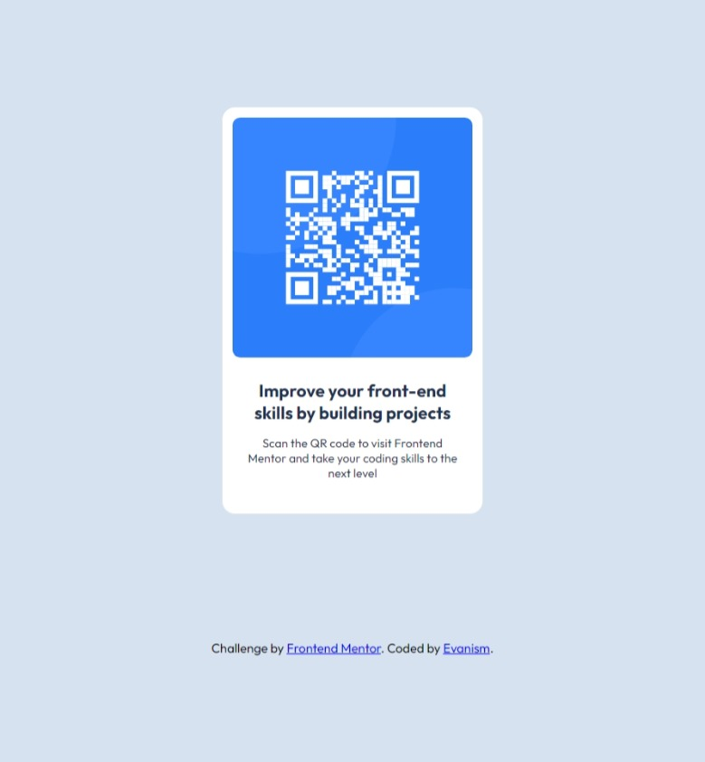

# Frontend Mentor - QR code component solution

This is a solution to the [QR code component challenge on Frontend Mentor](https://www.frontendmentor.io/challenges/qr-code-component-iux_sIO_H). Frontend Mentor challenges help you improve your coding skills by building realistic projects. 

## Table of contents

- [Overview](#overview)
  - [Screenshot](#screenshot)
  - [Links](#links)
- [My process](#my-process)
  - [Built with](#built-with)
  - [What I learned](#what-i-learned)
  - [Continued development](#continued-development)
  - [Useful resources](#useful-resources)
- [Author](#author)
- [Acknowledgments](#acknowledgments)

**Note: Delete this note and update the table of contents based on what sections you keep.**

## Overview

### Screenshot

### Links

- Solution URL: [Add solution URL here](https://your-solution-url.com)
- Live Site URL: [Add live site URL here](https://your-live-site-url.com)

### Built with

- Semantic HTML5 markup
- CSS custom properties
- Flexbox
- CSS Grid

**Note: These are just examples. Delete this note and replace the list above with your own choices**

### What I learned

I've learnt a bit of basic even tho I sneak a bit of answers.

### Continued development

I need to learn more about in depth css and then learn Javascript since I still don't know js even tho I started learning Vue and Nuxt

## Author

- Frontend Mentor - [@yourusername](https://www.frontendmentor.io/profile/BSIT-Evanism)
- Twitter - [@Eveneve4U](https://www.twitter.com/Eveneve4U)

## Acknowledgments

I give credits to Kevin Powell since his vanilla CSS guides and indepth deconstructions of elements made me understand css better

